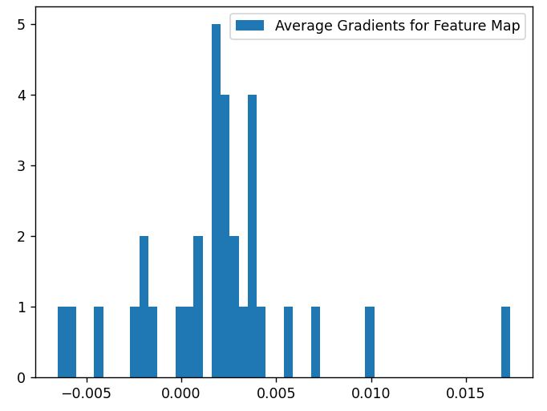
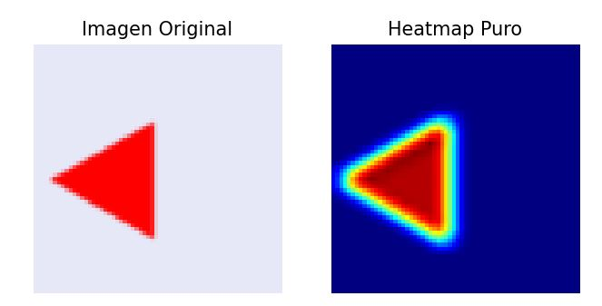

# 
 VISUAL QUESTION ANSWERING CON EARLY FUSION E INTELIGENCIA ARTIFICIAL EXPLICABLE 

# 1) DESCRIPCIÓN
- Se desarrolló un modelo *Visual-Question-Answering*, utilizando una red neuronal convolucional para la extracción de *features* de imágenes y un *Multilayer Perceptron* de tres capas lineales *fully connected* seguidas por la función de activación ReLU, para generar *embeddings* de texto a partir de representaciones *Bag of Words*.
- La técnica utilizada para combinar las modalidades de imágenes y texto fue *Early Fusion*, a través de la multiplicación de los vectores de ambas modalidades.
- Asimismo, se emplearon métricas de *clustering* como *Silhoutte Score* (intra-inter cluster) para medir la agrupación entre *embeddings* de texto respecto a temas/preguntas y su visualización en un espacio bidimensional mediante el algoritmo t-SNE.
- Además, se utilizó *Grad-CAM*, un método de *Explainable AI (XAI)*, para visualizar las regiones de la imagen que más influyeron en la clasificación de la red neuronal convolucional.
- Dado que las preguntas del *dataset* presentan una complejidad semántica manejable, se utilizó una arquitectura basada en *Bag of Words*, priorizando el análisis de los embeddings generados y la aplicación de técnicas de interpretabilidad (XAI).

----

# 2) ARQUITECTURA DEL MODELO

## 2.1) *TEXT ENCODER*

  

- **Tamaño del vector Bag of Words:** 27 (correspondiente al vocabulario del dataset).
- **Embedding Representation Layer:** 32 (los embeddings de texto se proyectan a 32 dimensiones para realizar early fusion con las imágenes mediante la multiplicación de vectores de ambas modalidades).

## 2.2) *IMAGE ENCODER*

  

- La imagen está en formato RGB; por ello, el número de canales inicialmente es 3, a partir del cual se aplican los *kernels* de las capas convolucionales. 
- **Kernels:** Se entrenaron modelos con diferentes tamaños de **kernels** en la primera capa convolucional: 16 y 32. Por ello, se detalla en la arquitectura.
- **MaxPool2D:** Para cada capa convolucional, se aplica la operación MaxPool seguida por la función de activación ReLU. 
- **Flatten:** Se aplica la operación *flatten* a la última capa convolucional para convertir los *feature maps* en un vector y proyectarlo a una dimensión de 32 mediante una capa lineal, y realizar early fusion con los embeddings de texto mediante la multiplicación de vectores de ambas modalidades.

## 2.3) *FUSION STRATEGY*

- Se utiliza la estrategia de *Early Fusion* mediante la multiplicación elemento a elemento de los *embeddings* (vectores) de imagen y texto, ambos de dimensión 32, obteniendo una representación conjunta multimodal.

## 2.4) *PREDICTION LAYER*

- La representación fusionada se procesa mediante una red *feed-forward* compuesta por dos capas lineales:
    - La primera capa reduce la dimensionalidad de 32 a 16, seguida de una función de activación ReLU
    - La segunda capa proyecta de 16 a 13 dimensiones, correspondientes al número de clases o respuestas posibles.

----
 
# 3) TECH STACK

- **Lenguaje de programación:** Python
- **Deep Learning Framework y XAI:** PyTorch
- **Preprocesamiento de datos (texto e imagen):** OpenCV, re
- **Métricas de clustering y t-SNE:** Numpy, Spicy, Sklearn
- **Almacenamiento de resultados:** json
- **Gráficas:** Matplotlib, SeaBorn
- **Flask:** Diseño de APIs y aplicación

----

# 4) DATASET
El dataset [link]

----

# 5) TRAINING PIPELINE

## 5.1) PREPROCESAMIENTO:

- **5.1.1) Imágenes:**
     
	 - Se realiza un resize de 64x64.
	    
	- Se reescala a un rango de 0-1.
		
	- Posteriormente, se convierte en un tensor para entrenar el modelo.
	 
- **5.1.2) Texto:**
     
- Se realiza una tokenización a nivel de palabra, considerando también incluyendo el signo de puntuación ? como un token independiente.

  - Cada texto de entrada se convierte en un vector numérico utilizando la técnica *Bag of Words*.

    - Finalmente, el vector resultante se transforma en un tensor para el entrenamiento del modelo. 

## 5.2) DIVISIÓN DE DATOS

- Del total de 38 000 muestras destinadas al entrenamiento, se utilizó el 80% para entrenamiento y el 20% restante para validación.
- Además, el conjunto de datos dispone de un conjunto independiente de 9k muestras utilizado exclusivamente para pruebas (test).

## 5.3) ENTRENAMIENTO DE LOS MODELOS

- Cada modelo fue entrenado con un máximo de 50 épocas. Sin embargo, se empleó la técnica de **Early Stopping**; por ello, no todos los modelos llegaron a entrenar 50 épocas exactas.
- Se utilizó un tamaño de batch de 64 para los datos de *train, validation y test*.
- La optimización se realizó mediante el optimizador Adam.
- La función de pérdida utilizada fue Cross-Entropy Loss.
- Durante cada época, el modelo se entrenó con el conjunto de entrenamiento y se evaluó sobre el conjunto de validación.
- Se almacenó el modelo con mejor desempeño en validación para su posterior evaluación en el conjunto de prueba.

## 5.4) HIPERPARÁMETROS

- Batch size (train, validation, test): 64
- Learning rate: 1e-4
- Número máximo de épocas: 50
- Optimizador: Adam
- Función de pérdida: Cross-Entropy Loss
- Kernels convolucionales: 16, 32 --> 32
- Dimensiones de los embeddings de texto: 64 --> 128 --> 32

----

# 6) DISEÑO EXPERIMENTAL

| KERNELS                    | TRAIN - BATCH SIZE | VALID - BATCH SIZE | CARACTERÍSTICAS                                                                        | MÉTRICAS (Accuracy) | NOTA                                                                                                                                                                                                                                                 |
|----------------------------|--------------------|--------------------|----------------------------------------------------------------------------------------|---------------------|------------------------------------------------------------------------------------------------------------------------------------------------------------------------------------------------------------------------------------------------------|
| 16 --> 32 (MaxPool2D+ReLU) | 64                 | 64                 | - Seed fija   - No Class Weight   - Multiplicación de features (Fusion)          | 0.60                | Se equivoca en las clases minoritarias (10/12), pero tiene un accuracy de 60% debido a que solo acierta las clases mayoritarias (sesgo).                                                                                                              |
| 16 --> 32 (MaxPool2D+ReLU) | 64                 | 64                 | - Seed fija   - Sí Class Weight   - Multiplicación de features (Fusion)                       | 0.79                | Se equivoca en detectar las formas de las figuras: circle [0], rectangle [7], triangle [9] (3/12).   --> Mejoró respecto al anterior.                                                                                                                  |
| 32 --> 32 (MaxPool2D+ReLU) | 64                 | 64                 | - Seed fija   - Sí Class Weight   - Layer Normalization   - Multiplicación de features (Fusion) | 0.98                | Al revisar los logits, eran números 'grandes'. Por ello, se decidió aplicar Layer Normalization para estabilizar el entrenamiento.   --> El modelo detecta mejor las formas de las figuras, con más de 90% en métricas como Precision, Recall, F1-Score |

----

# 7) RESULTADOS

| KERNELS                    | TRAIN - BATCH SIZE | VALID - BATCH SIZE | CARACTERÍSTICAS                                                                                       | Precision (clase minoritaria)                                     | Recall (clase minoritaria)                                        | F1-Score                                                          |
|----------------------------|--------------------|--------------------|-------------------------------------------------------------------------------------------------------|-------------------------------------------------------------------|-------------------------------------------------------------------|-------------------------------------------------------------------|
| 16 --> 32 (MaxPool2D+ReLU) | 64                 | 64                 | - Seed fija   - No Class Weight   - Multiplicación de features (Fusion)                         |                                                                   |                                                                   |                                                                   |
| 16 --> 32 (MaxPool2D+ReLU) | 64                 | 64                 | - Seed fija   - Class Weight   - Multiplicación de features (Fusion)                            | 0.39 - (shape1)   0.43 - (shape2)   0.47 - (shape3)   | 0.25 - (shape1)   0.49 - (shape2)   0.58 - (shape3)   | 0.30 - (shape1)   0.46 - (shape2)   0.52 - (shape3)   |
| 32 --> 32 (MaxPool2D+ReLU) | 64                 | 64                 | - Seed fija   - Class Weight   - Layer Normalization   - Multiplicación de features (Fusion) | 0.98 - (shape1)   0.97 - (shape2)   0.99 - (shape3)   | 0.96 - (shape1)   0.99 - (shape2)   0.98 - (shape3)   | 0.97 - (shape1)   0.98 - (shape2)   0.99 - (shape3)   |

----

# 8) INTERPRETABILIDAD

## 8.1) GRAD-CAM:

- Se aplicó Grad-CAM para visualizar las regiones de la imagen que más contribuyen a la predicción del modelo. Además, se utilizaron histogramas de activación para complementar el análisis de interpretabilidad.
- **RESUMEN:** Se utilizaron *hooks* en la última capa convolucional de PyTorch para obtener los mapas de características y sus gradientes. A partir de estos, se calcularon los pesos promedio de los gradientes (*gradient weights*), los cuales se utilizan para realizar una combinación ponderada de los *feature maps*. Finalmente, se aplica una activación ReLU para resaltar únicamente las contribuciones positivas asociadas a la clase predicha.
- A continuación, se muestra un ejemplo de la aplicación de Grad-CAM, que tiene como *input* la siguiente pregunta:
  - "what color is the shape?:
    

	 

	

	Figura: (izquierda) Histograma de Gradient Weights (derecha) Imagen y Heatmap.

> **NOTA**: Los mapas de Grad-CAM utilizan una escala de colores donde las zonas en rojo/amarillo indican mayor importancia para la predicción del modelo, mientras que las zonas en azul o colores fríos representan menor contribución.
