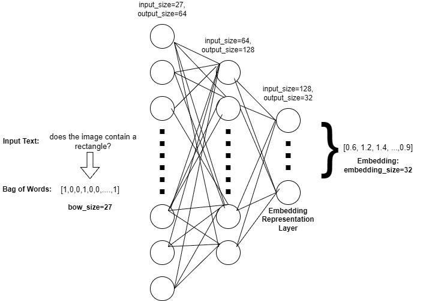
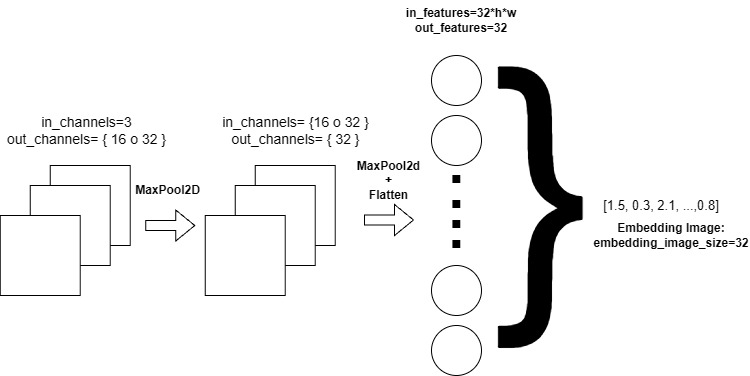

# 
 VISUAL QUESTION ANSWERING CON EARLY FUSION E INTELIGENCIA ARTIFICIAL EXPLICABLE 

# 1) DESCRIPCIÓN
- Se desarrolló un modelo *Visual-Question-Answering*, utilizando una red neuronal convolucional para la extracción de *features* de imágenes y un *Multilayer Perceptron* de tres capas lineales *fully connected* seguidas por la función de activación ReLU, para generar *embeddings* de texto a partir de representaciones *Bag of Words*.
- La técnica utilizada para combinar las modalidades de imágenes y texto fue *Early Fusion*, a través de la multiplicación de los vectores de ambas modalidades.
- Asimismo, se emplearon métricas de *clustering* como *Silhoutte Score* (intra-inter cluster) para medir la agrupación entre *embeddings* de texto respecto a temas/preguntas y su visualización en un espacio bidimensional mediante el algoritmo t-SNE.
- Además, se utilizó *Grad-CAM*, un método de *Explainable AI (XAI)*, para visualizar las regiones de la imagen que más influyeron en la clasificación de la red neuronal convolucional.
- Dado que las preguntas del *dataset* presentan una complejidad semántica manejable, se utilizó una arquitectura basada en *Bag of Words*, priorizando el análisis de los embeddings generados y la aplicación de técnicas de interpretabilidad (XAI).

# 2) ARQUITECTURA DEL MODELO

## 2.1) *TEXT ENCODER*

  

- **Tamaño del vector Bag of Words:** 27 (correspondiente al vocabulario del dataset).
- **Embedding Representation Layer:** 32 (los embeddings de texto se proyectan a 32 dimensiones para realizar early fusion con las imágenes mediante la multiplicación de vectores de ambas modalidades).

## 2.2) *IMAGE ENCODER*

  

- La imagen está en formato RGB; por ello, el número de canales inicialmente es 3, a partir del cual se aplican los *kernels* de las capas convolucionales. 
- **Kernels:** Se entrenaron modelos con diferentes tamaños de **kernels** en la primera capa convolucional: 16 y 32. Por ello, se detalla en la arquitectura. 
- **Flatten:** Se aplica la operación *flatten* a la última capa convolucional para convertir los *feature maps* en un vector y proyectarlo a una dimensión de 32 mediante una capa lineal, y realizar early fusion con los embeddings de texto mediante la multiplicación de vectores de ambas modalidades.

## 2.3) *FUSION STRATEGY*

- Se utiliza la estrategia de *Early Fusion* mediante la multiplicación elemento a elemento de los *embeddings* (vectores) de imagen y texto, ambos de dimensión 32, obteniendo una representación conjunta multimodal.

## 2.4) *PREDICTION LAYER*

- La representación fusionada se procesa mediante una red *feed-forward* compuesta por dos capas lineales:
    - La primera capa reduce la dimensionalidad de 32 a 16, seguida de una función de activación ReLU
    - La segunda capa proyecta de 16 a 13 dimensiones, correspondientes al número de clases o respuestas posibles.
